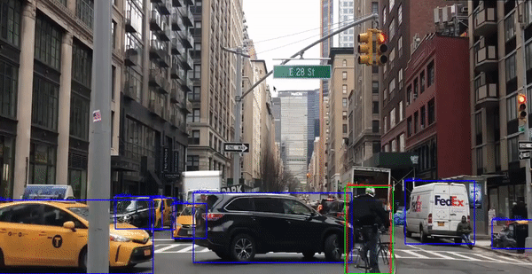

# Pedestrian-Vehicle-Bike & License Plate Demo


This application demonstrates how to run the Pedestrian-Vehicle-Bike and License Plate models, which detect pedestrians, vehicles, bicycles and license plates respectively, and are both SSD based.

The goal of this demo is to showcase the following:
 - To show OpenVINO's async API running inference in parallel, thus showcasing a simple, but extensible code sample for how the OpenVINO async API can be leveraged (ie. by running two different models at the same time).
 - A self-contained C++ code sample on OpenVINO, and avoiding the use of the Open Model Zoo demo internal library, allowing users to quickly see which code is relevant to the demo.

# How It Works
The demo application accepts several command line arguments for file paths (models and video input), and executes using the OpenVINO™ runtime plugin.

The demo can be stopped by pressing the "Esc" button.

# Preparing to Run
The list of models supported by the demo is in the models.lst file, which can be used as a parameter for the Open Model Zoo Model Downloaders.

`omz_downloader --precisions FP16 --list models.lst --o build`

##### Supported & Tested Models:
 - FP16/[person-vehicle-bike-detection-2002](https://github.com/openvinotoolkit/open_model_zoo/tree/master/models/intel/person-vehicle-bike-detection-2002)
 - FP16/[vehicle-license-plate-detection-barrier-0106](https://github.com/openvinotoolkit/open_model_zoo/tree/master/models/intel/vehicle-license-plate-detection-barrier-0106)

# Running
Run the application with `--help` to see available flags:
```
 usage: ./demo [--help] --in VIDEO_INPUT --pb PATH_TO_person-vehicle-bike-detection_xml --lp PATH_TO_vehicle-license-plate-detection-barrier_xml
```

```
Options:
  --lp \<vehicle-license-plate-detection-barrier xml path>
  --pb \<person-vehicle-bike-detection xml path>
  --in \<input video>
```

When options are not set, the application runs with the following defaults:

```
 --in cars.mp4
 --pb intel/person-vehicle-bike-detection-2002/FP16/person-vehicle-bike-detection-2002.xml
 --lp intel/vehicle-license-plate-detection-barrier-0106/FP16/vehicle-license-plate-detection-barrier-0106.xml
```

This allows for a quick testing setup:
```
 mkdir build && cd build
 cmake ..
 make
 omz_downloader --precisions FP16 --list ../models.lst
 ./demo --in <input video>
```

Video inputs can be a video file, or an IP webcam:

`./demo --in cars.mp4`

`./demo --in http://192.168.1.1:4747/video`

The demo can be stopped by pressing the "Esc" button.

# Demo Output
The demo produces a window where you can see inference take place in real-time - drawing bounding boxes around pedestrians, bicycles, vehicles and license plates.
